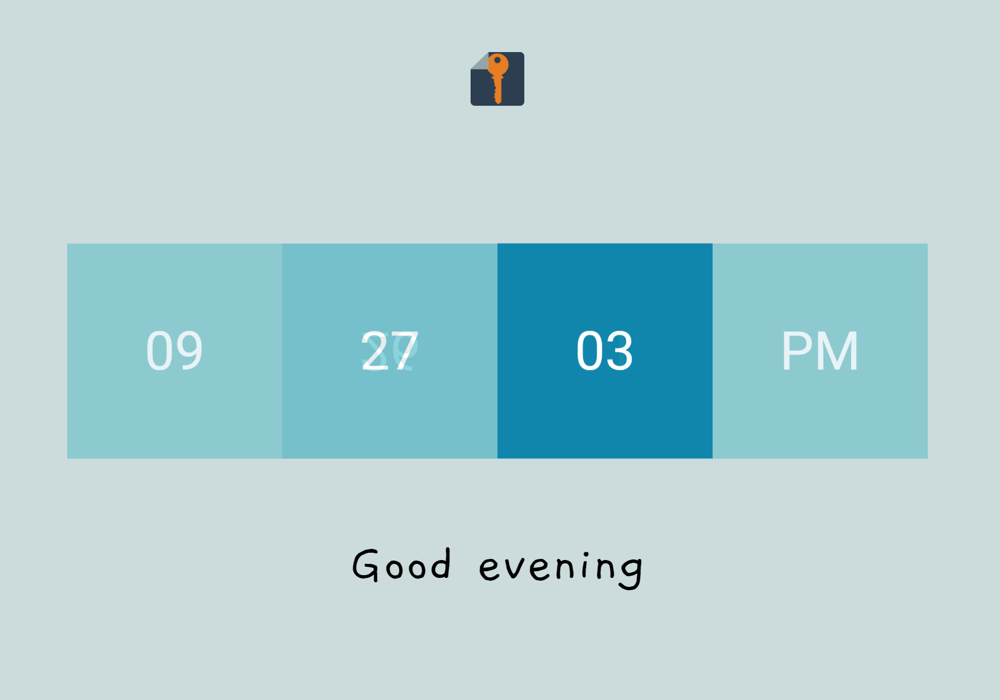

# react-clock

This is a React.js clock that uses 3D cubes to tell time. I used it as a mini-project to learn React.js in a hurry and make something cool.

# How It Works

The cube is formed using CSS 3D transform. Each rotation of the cube is applied to the `.cube` class, which contains 4 `.face` divs. The `transform` is set for each face (front, back, top, and bottom), and it stays the same all the time. The only thing rotating is the `.cube` class.

Each face is blank when the cube is created. The initial value is passed as a prop and assigned to the `.face-front` face. Then, every time the cube is assigned a new value via its `change()` method, it checks if there is a change in value. If there is, the cube will assign the new value to whichever face is next in line and rotate forward 90 degrees.

The line `transition: 0.5s all;` in the `.cube` class is responsible for the smooth rotation.

The project is mobile-friendly thanks to a few media queries at the end of [App.css](src/App.css).

Finally, a random phrase is assigned depending on the time of day. There is an array of phrases for morning, afternoon, and evening.

# Fonts

The clock uses Google's [Roboto font](https://fonts.google.com/specimen/Roboto). The phrases use [Gaegu](https://fonts.google.com/specimen/Gaegu).

# Fun Fact

The original name of this little guy was Cubert the Cute Clock.
